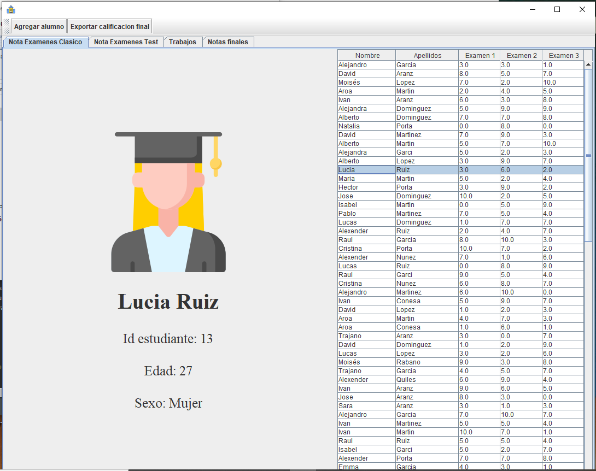
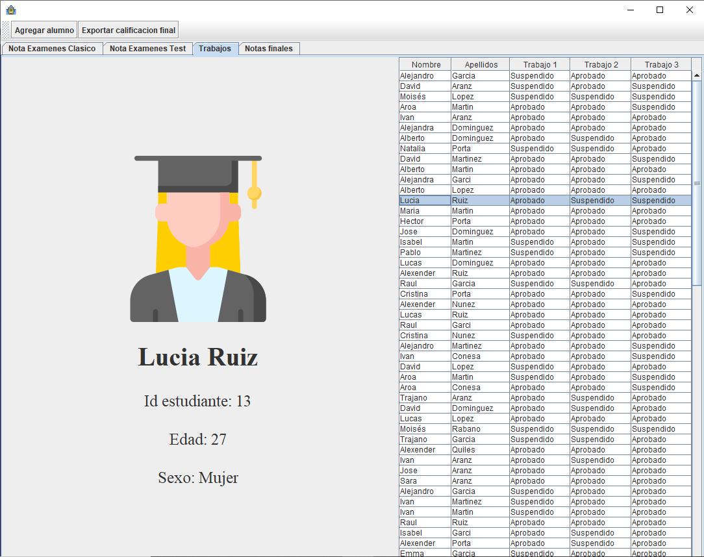
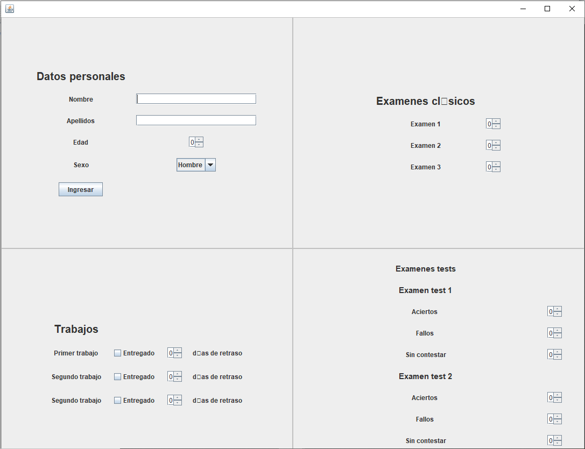
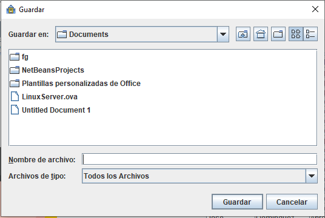

# MANUAL PARA EL USUARIO FINAL 

## ÍNDICE

1. INTRODUCCIÓN
2. PANTALLA PRINCIPAL
3. SELECCIONAR UN ALUMNO
4. DESGLOSE POR PESTAÑAS
5. AÑADIR ALUMNO
6. EXPORTAR

## 1 INTRODUCCIÓN

¿Cansado del endeble software de Generalitat que se cae con frecuencia?:sleepy: ¿Harto de aplicaciones confusas que dificultan la gestión de las notas?:dizzy_face: ¿Te gustaría hacerte una idea acertada de cómo han sido las notas del curso en el que enseñas con un sólo vistazo?:eyes:

¡No te preocupes! AlexElPaladín y KilosElBardo te presentan Student Marks, un software de gestión de notas de alumnos sencillo de utilizar y funcional. Student Marks permite visualizar las notas de los alumnos de un curso en una sola tabla, pero además también permite seleccionar los alumnos individualmente para visualizar sus datos importantes como la foto, el ID del estudiante, la edad o el sexo.
Por otro lado, Student Marks también permite seleccionar tipos de exámen o trabajos específicos para desglosar como se calcula la nota que aportan.

¡Unete ya a la siguiente generación de gestión de notas!:sunglasses:

## 2 PANTALLA PRINCIPAL

La pantalla principal de Student Mark te introduce a una visión general del curso y las opciones que están disponibles. En la parte superior izquierda existen las opciones de agregar un alumno y exportar la lista actual, para de esa forma descargarla, imprimirla etc. Inmediatamente debajo hay una serie de pestañas para seleccionar un tipo de examen o trabajo en especial y ver el desglose de como se calculan las notas de dichos exámenes o trabajos.
En cuanto a los datos que enseña la pantalla principal, se puede observar la información del alumno seleccionado y las notas de todo el curso.

## 3 SELECCIONAR UN ALUMNO

Si se hace click sobre cualquier alumno en la lista de la parte derecha, este alumno queda seleccionado y se visualizan sus datos en la parte izquierda  

## 4 DESGLOSE POR PESTAÑAS

En la parte superior izquierda de la tabla hay una serie de pestañas. Estas pestañas sirven para seleccionar elementos de evaluación (exámenes, trabajos) y ver el desglose de cómo se calculan sus notas. Haciendo click en cualquiera de las pestañas permite visualizarlo.

## 5 AÑADIR ALUMNO

En la parte superior izquierda de la aplicación es posible agregar un alumno. Al clickar en ella se abre una ventana para introducir los datos del alumno y seleccionar las notas de sus exámenes y sus entregas de trabajos.

## 6 EXPORTAR

A la derecha del botón de "Agregar alumno" está el de "Exportar calificación", que permite descargar algunos datos útiles.

© 2020 KilosElBardo, AlexElPaladin
All Rights Reserved.
